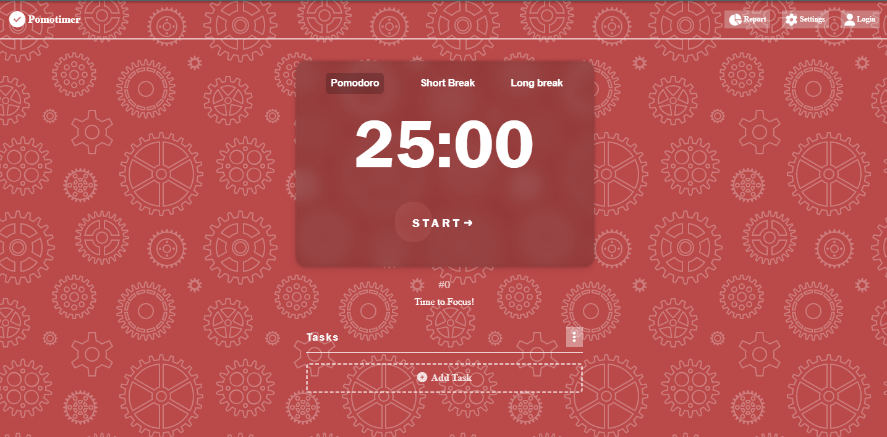

# Pomodoro-Timer
PomoTimer is a web application that helps you use the Pomodoro technique to concentrate more efficiently. It allows you to set and track the time you spend on a task, dividing it into periods of work and rest. Additionally, you can add tasks and predict how much time they will take. PomoTimer is built using HTML, CSS, and JavaScript.

### Features
- Countdown timer: The main feature of the webpage is a pomodoro timer that allows users to set a timer for a specific work session, followed by a break session. The timer counts down and provides notifications when the session is over.

- Task management: You can add tasks to the PomoTimer app and track your progress. The app will also predict how much time you will need to complete each task.

- Audio alarm: You can choose the audio alarm that will play when the work or rest period ends.

- Time tracking: PomoTimer keeps track of the time you have spent studying and the days you have accessed the app. This feature allows you to monitor your progress over time.

- Customizable session length: Users can customize the length of the work session and break session to suit their needs. This feature allows users to optimize their productivity by setting the appropriate session lengths.

- Session history: The webpage keeps track of the user's session history, including the date, start time, end time, and session duration. This feature helps users track their productivity and identify areas for improvement.

- Progress bar: The progress bar shows the progress of the current work session, giving users a visual representation of how much time they have left.

- Sound notifications: The webpage provides sound notifications when a session is over, allowing users to focus on their work without constantly checking the timer.

- Responsive design: The webpage is responsive, meaning it is optimized for viewing on different screen sizes and devices.

### How to use
1. To start, navigate to the webpage at https://mauroibarra29.github.io/Pomodoro-Timer/ using a web browser.
2. Set the time for work and rest periods according to your preferences.
3. Add a task to the app and predict how much time you will need to complete it.
4. Click the "Start" button to start the timer. The timer will begin counting down from the length of the work session.
5. Focus on your work during the work session. The progress bar will show you how much time is left in the session, and you will hear a sound when the session is over.
6. When the timer ends, take a break and rest for the specified time.
7. Repeat the process until you complete your task.
8. To view your session history, click the "Session history" button at the bottom of the page. This will display a table showing the date, start time, end time, and duration of each session.

### Technologies
This webpage was developed using several technologies, including HTML, CSS, and JavaScript. Additionally, the developer used the following knowledge and skills to create a functional and user-friendly pomodoro timer:

- localStorage: The localStorage API was used to store the user's session history data in the browser's local storage. This allowed the user to view their previous session data even after refreshing or closing the webpage.

- Audio manipulation: The webpage uses JavaScript's Audio API to play sound notifications when the work and break sessions are over. This required knowledge of audio manipulation techniques and event listeners.

- DOM manipulation: The developer used DOM manipulation techniques to update the progress bar and other elements of the webpage in real-time as the timer counts down.

- Arrays: Arrays were used to store and manipulate session data, such as the start and end times of each session.

- Events: The webpage relies heavily on JavaScript events, such as click events for buttons and timers for the work and break sessions.

- Match Media API: The developer used the Match Media API to implement a responsive design for the webpage, allowing it to adapt to different screen sizes and devices.

### Credits
PomoTimer was developed by Mauro Ibarra.

### Follow Me
If you enjoyed using this pomodoro timer and would like to stay up-to-date with my latest projects, you can follow me on Instagram and LinkedIn:

Instagram:  

LinkedIn:   

I appreciate your support and feedback, and I hope this pomodoro timer helps you improve your productivity and reach your goals!

### License
This project is licensed under the MIT License.
